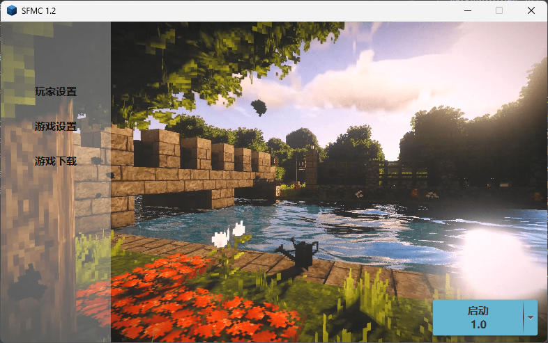
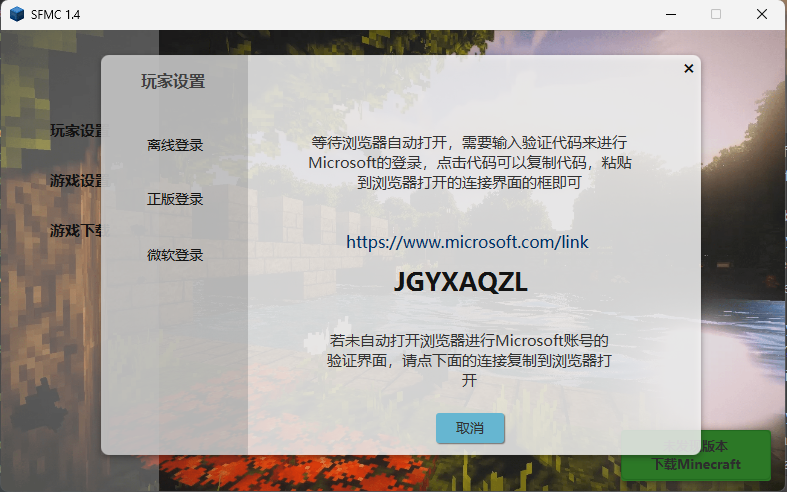
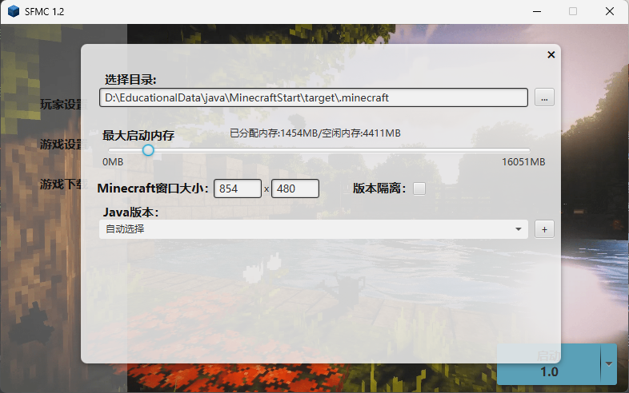
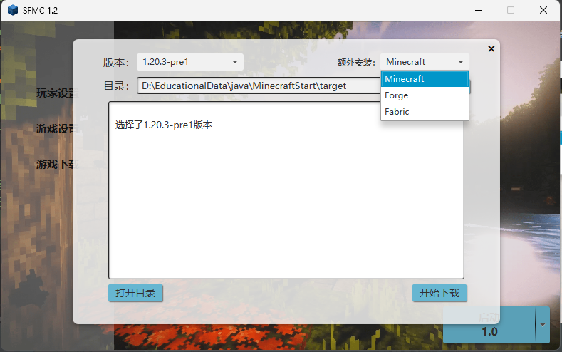

***
- [English](#sfmc-simple-minecraft-launcher)
- [中文](#sfmc-简陋的mc启动器)
***
# SFMC Simple Minecraft Launcher
***
## Catalogue
- [Brief Introduction](#brief-introduction)
- [Function](#Function)
- [Introduce](#Introduce)
    - [Main interface](#main-interface)
    - [Player Settings interface](#player-settings-interface)
    - [Game Settings interface](#game-settings-interface)
    - [Download interface](#download-interface)
- [Thank you for using](#thank-you-for-using)
### Brief Introduction
> A Minecraft launcher written through JMCCC, built by Java FX with an interface that is currently incomplete and may not be very attractive

***

### Function
> - [x] Launch Minecraft
> - [x] Choose Minecraft version
> - [x] Download all versions of **Minecraft**
> - [x] Support for download **Forge|Fabric**
> - [x] Support **Microsoft genuine** login
> - [x] Optional **Minecraft directory**
> - [x] Optional | Custom **JRE** version
> - [x] Adjustable game memory [temporarily unable to automatically allocate]
> - [x] Support version isolation
> - [x] JSON stores user data
> - [ ] ~~Support **genuine Mojang** login~~
> - [ ] ~~Support for downloading **Liteloader**~~
>
> _Don't pay attention to the first three, just gather the word count_

***
### Introduce
> #### Main interface
> On the left is the function list, Minecraft can be activated in the lower right corner, and the arrow on the right can select the version.
> 
> ***
> #### Player Settings interface
> There are currently two login methods, offline and Microsoft's legitimate login.  
> Just log in offline and enter the username you want, Microsoft verification is quite troublesome.
> 
> New Panel：
> 
> Microsoft Verification Steps：
> 1. After selecting Microsoft Verification, verification will not start. You must click on **Microsoft Verification** to start verification.
> 2. After clicking, a webpage will pop up asking you to enter the verification code. [if the browser is not opened, the default browser may not be set]
> 3. Next, the webpage will ask you to verify your Microsoft account. [_depending on the situation, you may be asked to enter the Microsoft account password, or you may be asked to enter the startup password_]
> 4. After successful verification, a page with completed verification will pop up, and you can then close the page.
> 
> New panel:
> 
> 5. After waiting for 4-10 seconds, it will automatically jump to your character information page.
>
> **Possible issues that may arise during validation：**  
> Q: Why didn't you respond after clicking **Microsoft verification**?  
> A: There may not be a default browser set. Click on the **link** of **launcher** , open the browser yourself, paste it into the address bar, and access it
>
> Q: Why have you been clicking **Microsoft Verification** and continuing to **"please wait"** ? 
> A: Please check if your network is abnormal or if your device is connected to the internet
>
> Q: Why does a webpage pop up after clicking **Microsoft verification**, but the webpage keeps loading?  
> A: Please check if your network is abnormal or if your device is connected to the internet
>
> Q: After entering the **verification code**, click Next and continue to log in to this interface using **Window Hello and security key**.
> A: Reopen the **link** to the **Launcher**, enter the **verification code** again, and click Next.
>
> Q: Microsoft shows that **verification is complete**, but the initiator has not changed  
> A: Your account may **not have Minecraft**,If so, please go to [ _www.minecraft.net_ ](https://www.minecraft.net)  and **log in to Microsoft**. Click on the **profile** to refresh the **profile**, and then use **Microsoft authentication** on the launcher here.
>
> _At present, this is the problem that I have tested and will encounter. If there are any problems, please provide timely feedback. Thank you!_
> ***
> #### Game Settings interface
> You can select a game directory, adjust game memory, select the appropriate JRE version, adjust window size, and enable version isolation  
> _I forgot to add **memory for automatic allocation**. I will add it later, as well as the jvm startup parameters and minecraft startup parameters._
> 
> ***
> #### Download interface
> Currently only supported for download **Minecraft**，**Forge**，**Fabric**  
> _**Liteloader**is too rarely used and currently not supported_  
> supported downloading the latest **Minecraft**，**Forge**  
> **Fabric** is Only the latest
> 
***
### Thank you for using
> This starter **doesn't have much technical content** [after all, it's someone else's bag], it's purely for practice use  
> Don't look at the size of this launcher, JavaFX accounts for 10 Mb, and there are also some packages with very little code, so the size of the launcher is so large.  
> If there are any issues, please provide timely feedback. Thank you!
***
***
***

# SFMC 简陋的MC启动器
***
## 目录
- [简介](#简介)
- [功能](#功能)
- [介绍](#介绍)
  - [主界面](#主界面)
  - [玩家设置界面](#玩家设置界面)
  - [游戏设置界面](#游戏设置界面)
  - [下载界面](#下载界面)
- [感谢使用](#感谢使用)

### 简介
> 通过JMCCC编写的一款Minecraft启动器，由JavaFX构建界面，目前界面待完善，可能不是很好看

***

### 功能
> - [x] 启动游戏
> - [x] 选择版本
> - [x] 下载所有版本 **Minecraft**
> - [x] 支持下载 **Forge|Fabric**
> - [x] 支持**微软正版**登录
> - [x] 可选择**启动目录**
> - [x] 可选择|自定义**jre**版本
> - [x] 可调整游戏内存[暂时不能自动分配]
> - [x] 支持版本隔离
> - [x] json储存用户数据
> - [ ] ~~支持**Mojang正版**登录~~
> - [ ] ~~支持下载 **Liteloader**~~  
> 
> _无需理会前三条，凑字数的_

***
### 介绍
> #### 主界面
> 左边为功能列表，右下角可启动Minecraft，右边的箭头可选择版本
> 
> ***
> #### 玩家设置界面
> 目前有两种登录方式，离线和微软的正版登录
> 离线登录输入你想要的用户名即可，微软验证比较的麻烦
> 
> 新界面
> 
> 微软验证步骤：
> 1. 选择微软验证后，不会开始验证，得点击 **微软验证** 才能开始验证
> 2. 点击后会弹出一个网页，会让你输入验证代码[若浏览器没打开可能没设置默认浏览器]
> 3. 接着网页会让你验证你的微软账号[_看情况，可能会让你输入微软账号密码，可能会让你输入开机密码_]
> 4. 验证成功后，会弹出一个验证完成的页面，这下你就可以关闭页面
> 
> 新界面
> 
> 5. 等待4-10秒后，会自动跳转到你的角色信息页面
> 
> **可能在验证中出现的问题：**  
> Q: 为什么点 **微软验证** 后，没有反应  
> A: 可能没有设置默认浏览器，点击一下**启动器**的**链接**，自行打开浏览器粘贴到地址栏中并访问
> 
> Q: 为什么点 **微软验证** 后，一直在 **请稍后...**  
> A: 请检查你的网络是否异常，或者设备是否联网
> 
> Q: 为什么点 **微软验证** 后，弹出一个网页，但是网页一直在加载  
> A: 请检查你的网络是否异常，或者设备是否联网
> 
> Q: 输入完 **验证代码** 后，点击下一步，然后一直在 **使用Window Hello和安全密匙登录** 这个界面  
> A: 重新打开**启动器**的**链接**，再次输入**验证代码**，点下一步
> 
> Q: Microsoft显示 **验证完成**，但是启动器一直没有变化  
> A: 你的账号可能并**未拥有**Minecraft，如果有请前往[ _www.minecraft.net_ ](https://www.minecraft.net)通过**微软登录**后点击**档案**刷新一下**档案**，然后在此使用启动器的**微软验证**
>
> _目前我测试出来会出现的问题就是这样，有问题及时反馈，谢谢！_
> ***
> #### 游戏设置界面
> 可以选择游戏目录，调整游戏内存，选择适合的jre版本，调整窗口大小，是否启用版本隔离
> 
> ***
> #### 下载界面
> 目前仅支持下载 **Minecraft**，**Forge**，**Fabric**  
> _**Liteloader**太少用了，暂时不支持_  
> 支持下载最新的 **Minecraft**，**Forge**  
> **Fabric** 只有最新的
> 
***
### 感谢使用
> 这个启动器**没什么技术含量**[毕竟用的是别人的包]，纯属练习所用  
> 别看这个启动器那么大,JavaFX可是占了10Mb，还有一些包，代码量很少，所以启动器的大小就这么大了
> 有问题及时反馈，谢谢！

_注意：部分界面想法借鉴与HMCL，若不允许，请联系我！这个软件不会发行，纯学习用！_